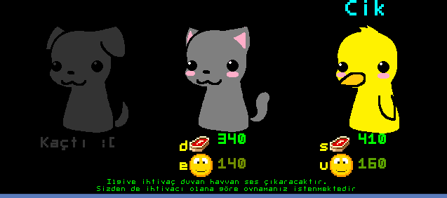

C++ Animal Game (cppag)
======================

This project is old. Idea is old. It created for dealing simple graphical action with cpp. Pretty much short. I think it might help some people for understanding things..

Idea
---------------
Press right button or else runs away :(

Compile'n Run
--------------------

Simply call lovely command

	make

	
Thanks
-------------
Special thanks to micromod for playing audio easily.

Screenshots
------------------

